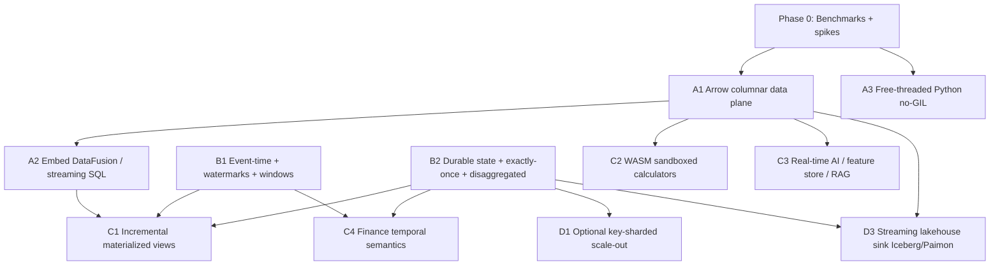

# DishtaYantra — Strategic Feature Roadmap

*Toward "best real-time compute server in its category"*
Draft v1 · derived from the 2026 competitive research · current product baseline: v3.3.0

---

## 1. North Star

> **The real-time compute server that runs on one big box, speaks every broker, lets you write calculators in any language at native speed, and never forces you to operate a cluster.**

Win on **latency, total cost of ownership, polyglot ergonomics, and operational simplicity** for the ~90% of workloads that fit a large single node — with a *graceful* scale-out path for the rest. This rides the two dominant currents of 2025–2026: the "single-node rebellion" (cluster fatigue; most datasets are small) and Python-native-with-a-native-core engines beating the JVM on ergonomics.

We do **not** try to out-Spark Spark on petabyte horizontal scale. That is their turf and against our DNA.

---

## 2. Guiding principles & non-goals

**Principles**
- **Scale up before scale out.** A single 100-core / multi-TB / NVMe box is the first-class deployment target.
- **Zero-copy everywhere.** Apache Arrow is the universal data plane; serialization is the enemy.
- **Polyglot at native speed.** Any language, sandboxed, no process-boundary tax.
- **Measure before you claim.** No "fastest" claim ships without a reproducible benchmark.
- **Preserve the moats we already have:** 20+ brokers, air-gapped/self-hosted, HA, market-aware scheduling.

**Non-goals (explicit)**
- Not becoming a cluster-by-default system.
- Not dropping broker breadth or air-gapped operation during the refactor.
- Not chasing feature parity with Spark's batch ecosystem.

---

## 3. Roadmap at a glance

| Phase | Theme | Headline outcome | Effort |
|------|-------|------------------|--------|
| **0** | Foundations & instrumentation | Benchmarks + observability + de-risking spikes | S–M |
| **1** | Core modernization | Arrow data plane, no-GIL Python, embedded vectorized SQL engine | XL |
| **2** | Streaming correctness | Event-time/watermarks + exactly-once + disaggregated state | XL |
| **3** | Differentiators | Incremental materialized views + WASM polyglot calculators | L |
| **4** | The moat & the AI wave | Finance temporal semantics + real-time AI / feature / RAG | L |
| **5** | Scale & ecosystem | Optional key-sharded scale-out + streaming lakehouse sink | M–L |

Indicative arc: ~18 months for a small focused team (≈3–6 engineers). Timelines scale with headcount; phases 1 and 2 are the long poles.

---

## 4. Dependency map

**Critical path:** Arrow data plane (A1) → DataFusion/SQL (A2) → incremental views (C1). In parallel: event-time (B1) and state/exactly-once (B2) feed both correctness and the differentiators. Free-threading (A3) is a relatively contained early unlock.

---

## 5. Phases in detail

### Phase 0 — Foundations & instrumentation
*You cannot claim "best in the world" without proof, and the two biggest bets need de-risking first.*

**Workstreams**
- **Benchmark harness** (Nexmark + a finance/trade-ETL workload mirroring `perftest/`): end-to-end latency percentiles, throughput, memory, recovery time. Make it CI-runnable.
- **Observability deepening** (`core/metrics`, existing Prometheus/Grafana): per-operator latency histograms, watermark lag, state size, checkpoint duration, queue depth.
- **Spike: free-threading** — build the dependency tree against Python 3.14t; inventory which C extensions (`core/cpp`, `core/rust`, pyarrow, broker clients) need recompilation/thread-safety work.
- **Spike: Arrow data plane** — prototype an Arrow `RecordBatch` edge between two nodes and a zero-copy handoff into a C++/Rust calculator.
- **RFCs**: Arrow data-plane design and a unified state abstraction.

**Exit criteria:** reproducible baseline numbers published internally; both spikes prove feasibility or surface blockers; two RFCs approved.
**Risks:** free-threading C-extension gaps. **Mitigation:** the spike is the gate for A3 scope.

---

### Phase 1 — Core modernization (the engine that makes single-node fast)
*This is the payoff that lets one box out-throughput a small Spark cluster.*

> **Progress (A1):** delivered so far — the `ArrowCalculator` contract (additive,
> drop-in), vectorized example calculators with exact row-parity, an end-to-end
> vertical slice, an old/new coexistence demonstration, a tutorial, and **opt-in
> source-batching nodes** (`BatchingSubscriptionNode` / `FlatteningPublicationNode`)
> that make batching automatic while preserving the per-message contract. The
> engine (`core/dag/*`, `core_calculator.py`) remains unchanged. Remaining for A1:
> carry Arrow `RecordBatch`es on edges to remove the per-stage envelope deep-copy
> (the current throughput cap), then zero-copy polyglot handoff and spill.

**A1 — Arrow-native columnar data plane** *(XL, the keystone)*
- Make Arrow `RecordBatch` the in-memory format flowing through `core/dag` edges, into calculators, and to sinks.
- Zero-copy, zero-serialization handoff across Python/C++/Java/Rust calculators via the Arrow C Data Interface (`core/calculator`, `core/cpp`, `core/jvm`, `core/rust`), reusing the existing LMDB zero-copy story (`core/lmdb`).
- Vectorized batch execution (operate on columns, not row-at-a-time).
- Larger-than-memory streaming with spill-to-disk.

**A3 — Free-threaded (no-GIL) Python** *(M–L)*
- Adopt the 3.14+ free-threaded build for the scheduler and Python calculators; let them scale across cores with shared memory instead of the multiprocessing serialization tax (`core/workers`, `core/multiprocessing`).
- Keep the worker-pool path as a fallback during transition.

**A2 — Embed DataFusion (Rust, Arrow-native) for vectorized execution + initial streaming SQL** *(L)*
- Use it for heavy relational ops (joins/aggregations/filters) and a first `SELECT ... FROM stream`.
- Polyglot calculators become zero-copy UDFs.

**Exit criteria:** measured vectorized throughput up materially vs v3.3.0; GIL removed for core paths; zero-copy calculator handoff; streaming `SELECT` works end-to-end.
**Beats Spark/Flink:** no JVM serialization, no shuffle, no network — memory-bandwidth-speed on one box, with SQL ergonomics and none of PyFlink's pain.
**Risks:** Arrow migration touches many modules; broker adapters must keep working. **Mitigation:** migrate edge-by-edge behind a compatibility shim; broker regression suite per merge.

---

### Phase 2 — Streaming correctness (be taken seriously vs Flink)
*Catch-up where it genuinely matters, plus the state foundation everything else needs.*

**B1 — Event-time + watermarks + windowing** *(L)*
- Add event-time semantics, watermarks, allowed-lateness, and tumbling/sliding/session windows to `core/dag` (today the engine is processing-time only — no watermark support exists).

**B2 — Durable state + exactly-once + disaggregated backend** *(XL)*
- Incrementally-checkpointed keyed state (LMDB local + async barrier snapshots) building on `core/lmdb`/`core/storage`.
- End-to-end exactly-once via transactional/idempotent sinks committed on checkpoint (`core/pubsub`).
- Disaggregated state to object storage (the Flink 2.0 / RisingWave direction) so state can exceed one node's RAM and recovery/rescale is fast — this is also the bridge to optional scale-out.

**Exit criteria:** correct event-time windowing on out-of-order input; exactly-once verified under fault injection; state survives HA failover (`core/ha`); recovery within target SLO.
**Beats Spark/Flink:** gives the fault-tolerance guarantees enterprises require, on the architecture the leaders are themselves migrating toward.
**Risks:** exactly-once correctness is subtle. **Mitigation:** fault-injection test suite as a first-class deliverable.

---

### Phase 3 — Differentiators (best-in-world features)

**C1 — Incremental materialized views / "streaming tables"** *(L)*
- `CREATE MATERIALIZED VIEW ... AS SELECT` over DAG streams, incrementally maintained (depends on A2 SQL + B1 event-time + B2 state). Turns DishtaYantra into a streaming database; serve fresh results via SQL and replace cache-of-aggregations patterns.

**C2 — WASM sandboxed polyglot calculators** *(L)*
- Calculators compiled to WebAssembly: any source language, sandboxed for multi-tenant safety, near-native speed, hot-deployable, zero-copy Arrow in/out (depends on A1). Makes the README tagline literally true.

**Exit criteria:** an incrementally-maintained view stays correct under updates/deletes; a user-supplied WASM calculator runs sandboxed with zero-copy handoff.
**Beats Spark/Flink:** combines incremental SQL views *and* any-language sandboxed UDFs — an ergonomics combination neither offers.

---

### Phase 4 — The moat & the AI wave

**C4 — Finance / market-aware temporal semantics** *(M–L)*
- Build on the existing market-aware scheduling (`core/schedule`, holiday calendars): market-session windows, **as-of / point-in-time joins** (critical for trading and risk), trading-calendar-aware watermarks, and strict/serializable consistency for regulatory calculations.

**C3 — Real-time AI: inference, feature store, RAG freshness** *(L)*
- In-DAG model-inference calculator node; online feature-store semantics; continuously-updated vector/embedding indexes for fresh RAG context. This is the fastest-growing vector in the market and where the leaders are racing.

**Exit criteria:** as-of join produces point-in-time-correct results; a real-time feature pipeline and a RAG-freshness pipeline ship as reference templates.
**Beats Spark/Flink:** the only engine combining finance-temporal correctness + real-time AI + air-gapped operation + enterprise broker breadth.

---

### Phase 5 — Scale & ecosystem (remove the ceiling, close the two-stack gap)

**D1 — Optional key-sharded scale-out** *(M–L)* — on the disaggregated-state foundation (B2); consistent hashing on keys across a few nodes. Kept as the exception, not the default.
**D3 — Streaming lakehouse sink (Iceberg/Paimon, exactly-once)** *(M)* — one engine feeds both real-time consumers and the lakehouse, closing the "two stacks" problem.
**D2 — Credit-based backpressure end-to-end** *(S–M, can start earlier)* — graceful degradation under load while holding latency (extends existing backpressure handling).
**D4 — Publish benchmarks** *(S)* — public Nexmark + TCO numbers for credibility.

**Exit criteria:** a DAG shards across nodes with consistent results; processed streams land transactionally in Iceberg/Paimon; published numbers.

---

## 6. Quick wins vs big bets

**Quick wins (weeks):** benchmark harness, observability deepening, credit-based backpressure, free-threading spike, published numbers.
**Big bets (quarters):** Arrow data plane (A1), exactly-once + disaggregated state (B2), incremental views (C1), WASM calculators (C2).

Sequence the quick wins early — they build credibility and measurement before the expensive engine work.

---

## 7. Cross-cutting risks & mitigations

| Risk | Mitigation |
|------|------------|
| Free-threading ecosystem still maturing | Phase 0 spike gates scope; keep worker-pool fallback |
| Arrow migration touches many modules | Edge-by-edge behind a shim; broker regression suite per merge |
| Exactly-once correctness is subtle | Fault-injection test suite as a first-class deliverable |
| Scope creep across many programs | Strict phase gates; ship correctness (P2) before differentiators (P3) |
| Maintaining broker breadth during refactor | Treat the 20+ adapters as a protected contract with their own CI |
| Finance correctness must be provable | Golden-dataset point-in-time tests for as-of joins / regulatory calcs |

---

## 8. Definition of "best in class" — success metrics

- **Latency:** single-digit-ms p99 event-to-output on the hot path (Flink-class).
- **Throughput:** target millions of events/sec per large node on the Arrow vectorized path.
- **TCO:** demonstrably lower cost than an equivalent small Spark cluster for a fixed workload.
- **Recovery:** state recovery and rescale within a defined SLO after failover.
- **Ergonomics:** a calculator in any language deployed in minutes, zero-copy, sandboxed.
- **Correctness:** exactly-once and event-time correctness verified under fault injection and out-of-order input.

---

## 9. Suggested first 90 days

1. Stand up the benchmark harness + observability baseline (Phase 0).
2. Run the free-threading and Arrow spikes; write the two RFCs.
3. Start the Arrow data plane (A1) on one DAG path end-to-end as a vertical slice, with the broker regression suite guarding it.
4. Ship credit-based backpressure (a contained quick win) in parallel.

Everything after follows the dependency map: A1 → A2 → C1, with B1/B2 progressing alongside to unlock the differentiators and the moat.
