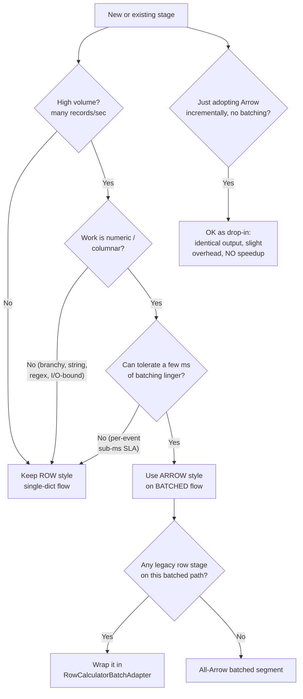

# A1 Worked Example & Old/New Coexistence

*Roadmap Phase 1, step A1. Companion to `docs/design/A1-arrow-data-plane.md`.*
Status: **implemented & demonstrated** · runnable: `python -m perftest.run_arrow_example`

This document answers two questions directly, with a runnable demonstration:

1. **Can old-style and new-style DAGs / calculators coexist in the same running instance?** — **Yes.**
2. **Can a single graph contain both old-style and new-style nodes / calculators?** — **Yes.**

Both are confirmed by `perftest/run_arrow_example.py` and locked in by
`tests/test_arrow_coexistence.py` (20,000 trades, identical output, 0 mismatches).

---

## 1. Why coexistence is guaranteed

The Arrow path is **purely additive**. The engine (`core/dag/*`) and the base
`DataCalculator` are unmodified. Two facts in the existing builder make mixing
work with no special handling (`core/dag/compute_graph.py`,
`core/dag/compute_graph_builders.py`):

- **Node types are resolved per node** — each node's `type` is looked up
  independently (built-in class or dotted-path custom). A graph is never
  required to be homogeneous.
- **Calculator types are resolved per calculator** — each calculator's `type`
  is resolved independently (built-in or dotted path).

And the key design choice: an **`ArrowCalculator` *is* a `DataCalculator`**. Its
`calculate(data)` accepts a single dict (processed as a 1-row batch) or a
batch-envelope dict `{"batch": [...]}` (processed vectorized). So an Arrow
calculator is a drop-in anywhere a row calculator goes.

### Q1 — same instance, multiple DAGs
Each DAG is an independent `ComputeGraph`. A server already runs many graphs at
once; some can be all-row, others can use Arrow calculators. The worked example
runs an all-row graph and a mixed graph **in the same process** and both deliver
all 20,000 trades.

### Q2 — one graph, mixed nodes
The worked example DAG (`perftest/perftest_arrow_mixed.json`) is a single graph:

```
ingest → validate[row] → normalize[row] → fx[Arrow] → notional[Arrow]
       → fee[Arrow] → risk[row] → classify[row] → sink
```

On single-dict flow every stage interoperates, and the output is **bit-identical**
to the all-row pipeline (max abs error 0.0 over 20,000 trades).

---

## 2. The coexistence rule (the one thing to know)

What flows on the edge decides whether a stage needs an adapter:

| Edge carries… | Row calculator | Arrow calculator |
|---|---|---|
| **single dict** (old style) | native | works as a drop-in (1-row batch) — **correct, but adds per-row overhead; no speedup** |
| **batch envelope** `{"batch":[…]}` (new style) | needs `RowCalculatorBatchAdapter` (auto-wrappable) | native, **vectorized — this is the speedup** |

So the only hard rule: **don't feed a batch envelope to a bare row calculator.**
Wrap it with `RowCalculatorBatchAdapter` (which applies the row calc per record),
or keep that stage on single-dict flow.

### Honest performance note
The worked example puts the Arrow stages on **single-dict** flow to prove
coexistence and exact parity. In that mode the Arrow stages are *slower* than
row (each call builds a 1-row Arrow batch — pure overhead). The vectorization
win appears only on **batched** flow: `benchmarks/a1_vertical.py` shows ~1.8×
end-to-end at batch 500, and the pure kernel is ~11.8× (`benchmarks/arrow_vectorization_spike.py`).
**Use Arrow stages in batched mode for performance; use them in single-dict mode
only for incremental adoption / correctness.**

---

## 3. Decision tree: row (old) vs Arrow (new), and whether to batch



ASCII version:

```
Is the stage high-volume (many records/sec)?
├─ No ............................................ keep ROW (single-dict)
└─ Yes → Is the per-record work numeric/columnar?
         ├─ No (branchy/string/regex/I-O bound) .. keep ROW
         └─ Yes → Can it tolerate a few ms linger?
                  ├─ No (per-event sub-ms SLA) .... keep ROW
                  └─ Yes ......................... use ARROW on BATCHED flow
                                                    └─ legacy row stage on that
                                                       path? wrap in
                                                       RowCalculatorBatchAdapter

Just want incremental Arrow adoption without batching?
  → fine as a drop-in: identical output, slight overhead, no speedup.
```

### Where A1 benefits (summary)
- **Strong:** high-volume, schema-regular, numeric/columnar streams (trade/tick
  ETL, FX/notional/risk, aggregation, telemetry), latency budget tolerant of a
  small linger, and especially native (C++/Rust/Java) calculators (zero-copy).
- **Weak/negative:** low-volume or bursty paths, ultra-low-latency per-event
  decisions, branchy/string-heavy logic, heterogeneous/schema-less messages,
  fan-in/fan-out branching, and I/O-bound stages.

---

## 4. Running the worked example

```bash
python -m perftest.run_arrow_example --trades 20000
```

Expected: Q1 CONFIRMED (both graphs deliver in one process), Q2 IDENTICAL/CONFIRMED
(mixed graph == all-row, 0 mismatches), coexistence sanity ok.

Files (all in `perftest/`):
- `perftest_arrow_mixed.json` — the single mixed graph (row + Arrow stages).
- `arrow_etl_calculators.py` — vectorized FX / notional / fee / risk, each
  output-identical to its `etl_calculators.py` row counterpart.
- `run_arrow_example.py` — the runnable demonstration.

---

## 5. Backward-compatibility guarantees

- The engine (`core/dag/*`) and `core/calculator/core_calculator.py` are
  **unchanged** — existing DAGs, calculators, and stored configs behave exactly
  as before (verified by diff against the prior release).
- Stored DAG JSON gains only optional, dotted-path calculator references; old
  configs parse and run identically.
- Arrow calculators are new classes; nothing forces an existing DAG to adopt them.
- The opt-in source-batching node types (`BatchingSubscriptionNode`,
  `FlatteningPublicationNode`) are additive subclasses; `SubscriptionNode` and
  `PublicationNode` are unchanged, so existing DAGs are unaffected.
- Exact-parity and coexistence are guarded by CI
  (`tests/test_a1_vertical.py`, `tests/test_arrow_coexistence.py`).
